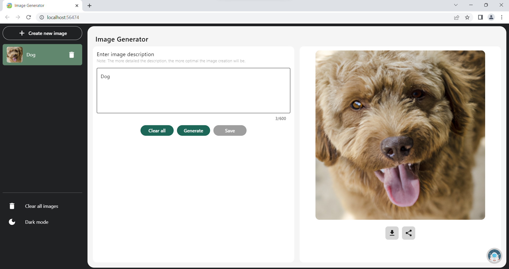
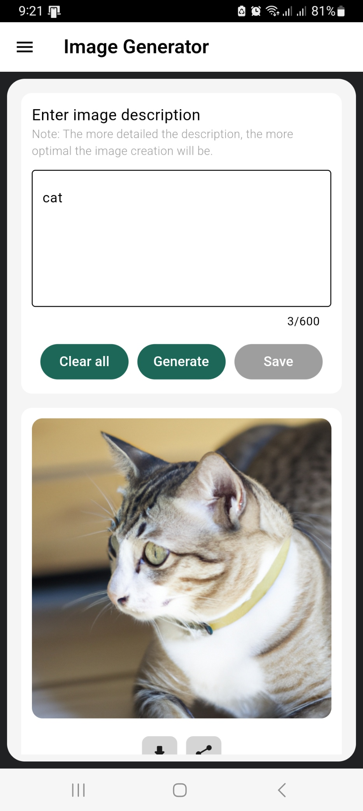

# Image Generator

## Introduce

**Image Generator** that allows create realistic images and art from a description in natural language.

- Available functions:
    - Create images from description text.
    - Download and share image.
    - Save image in gallery.
    - Dark/Light mode.

## Project Information

- Support platform: Web, Windows, Android.
- Technology:
    - Flutter v3.7.3
    - Dart v2.17.5
- API: [DALL-E OpenAI](https://platform.openai.com/docs/api-reference/images/create)

## Screenshots

| For Web  | For App |
|---|---|
|   |   |

## Github

https://github.com/CK1412/image_generator

## How to run Project

> Assuming you already have a runtime environment for Flutter

- Clone this project and open with Visual Studio Code.

- Create a file named .env in the root of your project and add the following line to store your API key:

    ```env
    API_KEY=[YOUR_API_KEY]   
    ```
> The commands below will be run on Terminal of VSCode.

- To install dependences, run: `flutter pub get`

- Run code-generators: `flutter packages pub run build_runner build --delete-conflicting-outputs`

> I have configured for two environments: development and production. Here ?> are the running instructions for the development environment.

- Now, run the project: `flutter run --flavor development --target lib/main/main_development.dart`

- Alternatively you can run it manually.

## How to Build and Release 

- [Build and release an Android App](https://docs.flutter.dev/deployment/android)

- [Build and release an Web App](https://docs.flutter.dev/deployment/web)

- [Build and release an Windows App](https://docs.flutter.dev/deployment/windows)

> Note: **Do not** use environment variables in .env file when building web. 

## License

[MIT License](LICENSE)

## Troubleshooting

### Image not showing

- This is a [CORS error](https://developer.mozilla.org/en-US/docs/Web/HTTP/CORS/Errors). To fix it go to [CORS-ANYWHERE](https://cors-anywhere.herokuapp.com/corsdemo).

### Do not show the interface when deploying the web

- The site will not display the content because the **API_KEY** value is set in the `.env` file. So don't use the .env file but put the **API_KEY** value directly in the code then proceed to build the web.
